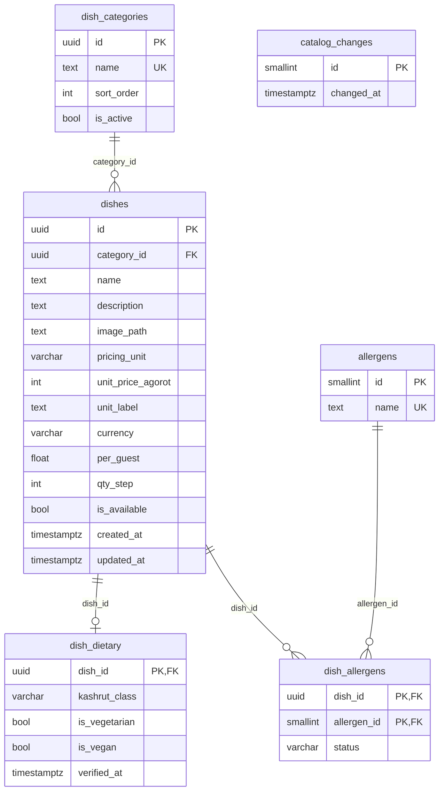

# ERD

Tables, columns and relationships only. Source: `database/migrations/`.

```mermaid
erDiagram
    dish_categories ||--o{ dishes : "category_id"
    dishes ||--o| dish_dietary : "dish_id"
    dishes ||--o{ dish_allergens : "dish_id"
    allergens ||--o{ dish_allergens : "allergen_id"

    dish_categories {
        uuid id PK
        text name UK
        int sort_order
        bool is_active
    }
    dishes {
        uuid id PK
        uuid category_id FK
        text name
        text description
        text image_path
        varchar pricing_unit
        int unit_price_agorot
        text unit_label
        varchar currency
        float per_guest
        int qty_step
        bool is_available
        timestamptz created_at
        timestamptz updated_at
    }
    dish_dietary {
        uuid dish_id PK, FK
        varchar kashrut_class
        bool is_vegetarian
        bool is_vegan
        timestamptz verified_at
    }
    allergens {
        smallint id PK
        text name UK
    }
    dish_allergens {
        uuid dish_id PK, FK
        smallint allergen_id PK, FK
        varchar status
    }
    catalog_changes {
        smallint id PK
        timestamptz changed_at
    }
```

`catalog_changes` is a single-row Realtime signal table and has no relations.
